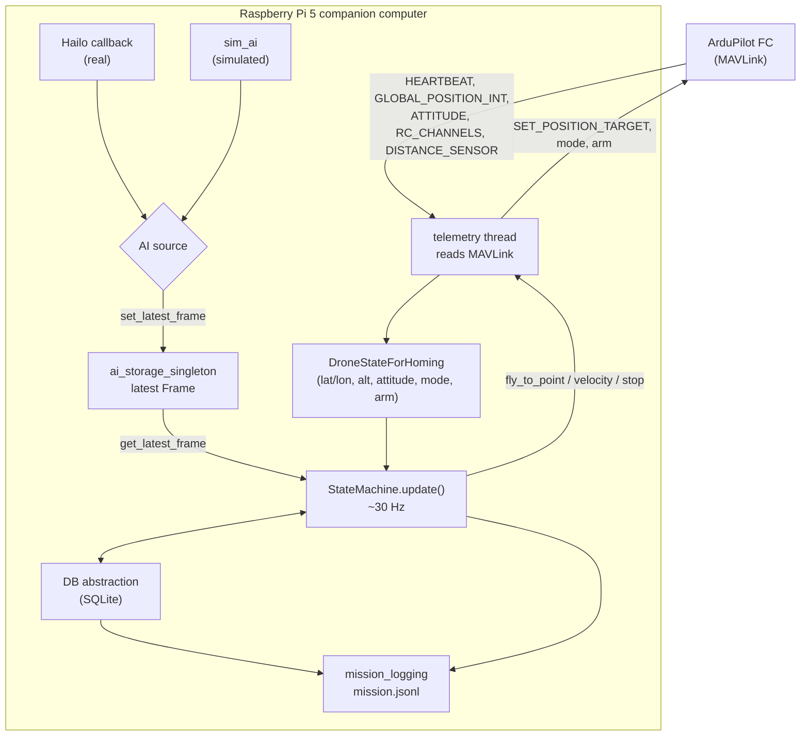
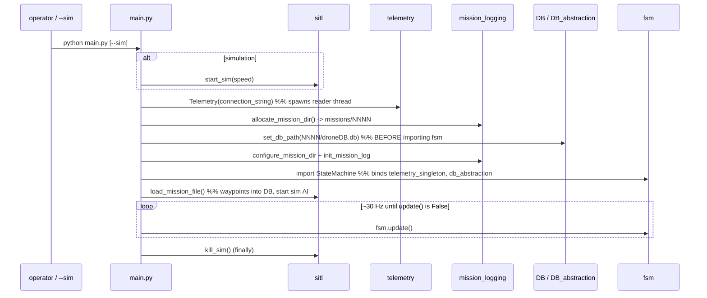
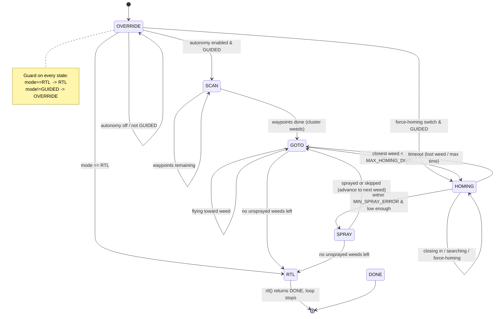
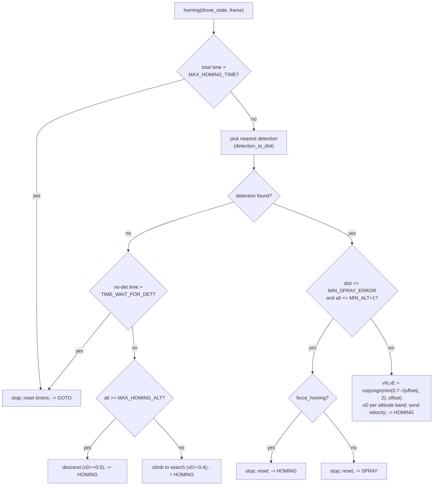
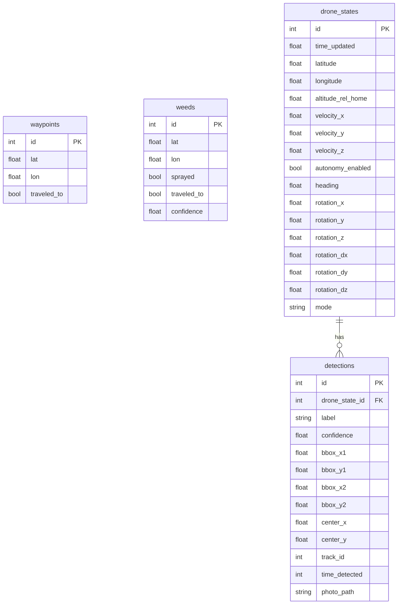

# skydock2 Architecture

A current, code-true description of the system, replacing the older
`docs/SD_design_diagrams.drawio`. Each section below mirrors a page of that
file; the final [Design vs implementation drift](#design-vs-implementation-drift)
section records where the original design and the code now diverge.

Diagrams are [Mermaid](https://mermaid.js.org/) — they render on GitHub and in
most Markdown viewers, and are readable as plain text.

---

## 1. System overview

(Mirrors the drawio `current_sys_digram` page.)

The flight controller runs ArduPilot. The Pi's `telemetry` thread keeps a single
`DroneStateForHoming` up to date from MAVLink. The AI source (real Hailo callback
or the simulator) publishes `Frame`s into `ai_storage_singleton`. The
`StateMachine` reads both each tick, issues movement commands back through
`telemetry`, and reads/writes weeds and waypoints through the DB abstraction.
Everything of interest is also appended to `mission.jsonl`.



**Contract between the FSM and the DB** (from the drawio "IN/OUT" note):
the FSM puts *in* the current position + frame and the facts "waypoint traveled
to", "weed traveled to", "weed sprayed"; it gets *out* the next weed location and
the next waypoint.

---

## 2. Startup sequence

(Mirrors the implicit init order in [main.py](../main.py); not a drawio page, but
load-bearing.)

The order is deliberate: the telemetry singleton and the per-mission DB path must
exist **before** `fsm`/`DB_abstraction` are imported, because those modules bind
module-level singletons at import time.



---

## 3. Mission FSM

(Mirrors the drawio `FSM` / `fsm lazzy` pages, made code-true.)

`StateMachine.update()` dispatches on `current_state`. Every non-terminal handler
first calls `_override_and_rtl_checks()`, so two pilot/FC conditions pre-empt all
autonomous logic: **mode RTL → RTL**, and **mode ≠ GUIDED → OVERRIDE**.



Notes:
- `RTL` and `DONE` both stop the mission loop (`update()` returns `False`).
- The actual return-to-launch flight is flown by ArduPilot once the FC is in RTL
  mode; the FSM only stops.

---

## 4. Homing flow

(Mirrors the drawio `Homing state` page; constants from [constants.py](../constants.py).)



The horizontal velocity law and the climb/descend rates are magic numbers today;
see the refactor plan, Phase 3.

---

## 5. Data model

(Mirrors the drawio `DB schema` page, which sketched a single "Scan results"
table; the implementation has four related tables — see [DB.py](../DB.py).)



Per-mission DBs are disposable — each run gets a fresh
`missions/NNNN/droneDB.db`, and `load_mission_file` calls `backup_and_clear`
(dumping the prior DB to `database_snapshot.json`) before loading waypoints.

### mission.jsonl event catalogue

One JSON object per line. Common fields: `ts`, `level`, `logger`, `event`, and
optionally `drone_state` / `frame` payloads.

| Logger | Events |
|--------|--------|
| `main` | `mission_start`, `constants_snapshot`, `mission_plan` |
| `fsm` | `fsm_transition`, `fsm_tick` |
| `telemetry` | `telemetry_sample`, `move_command` |
| `ai` | `weed_detected` |
| `homing` | `homing_tick`, `homing_alt_cap`, `homing_give_up_timeout`, `homing_give_up_no_det`, `spray_ready` |
| `spray` | `spray_attempt`, `spray_miss` |
| `db` | `db_waypoint_add`, `db_waypoint_traveled`, `db_weed_add`, `db_weed_traveled`, `db_weed_sprayed`, `db_snapshot`, `db_backup`, `db_clear_all` |
| `sim_ai` | `sim_vision_params` |

Drone-state payloads are produced from `vars(DroneStateForHoming)`, so keys
follow the dataclass field names (`rotation`, `height`, `arm_state`, …). Logs
written before the 2026-06 typo rename used `rotaion`/`hight`; the analysis tools
in `tools/log_server` accept both.

---

## Mission JSON format

Produced by [mission_gen.py](../mission_gen.py), consumed by `sitl.load_mission_file`:

```json
{
  "field_center": [lat, lon],
  "weed_locations": [{"id": 0, "lat": -35.36, "lon": 149.16}, ...],
  "scan_path": [[lat, lon], [lat, lon], ...]
}
```

Sim files also carry `"is_sim": true`. `scan_path` is a lawnmower (serpentine)
sweep of the padded bounding box of the weeds.

---

## Threading model

| Thread | Created by | Role |
|--------|-----------|------|
| Telemetry reader | `Telemetry.start_passer` | Reads MAVLink, updates `DroneStateForHoming`, drains waypoint queue |
| Velocity repeater | `move_velocity_until_stop_or_max_time` | Re-sends a velocity setpoint every ~30 ms (FC needs <3 s refresh) |
| AI source | `sim_ai.run_sim_ai` or Hailo `make_ai_app().run` | Produces `Frame`s into `ai_storage_singleton` |
| Main / FSM | `main.py` | Calls `StateMachine.update()` at ~30 Hz |

`ai_storage_singleton` guards the current frame with a lock. Frame and drone
state are otherwise read by the single FSM thread.

---

## Design vs implementation drift

How the current code differs from the `docs/SD_design_diagrams.drawio` pages.

### `As Is` page (pre-simulation architecture)
The original design had distinct **GroundStation + Radio** messaging, a **Move**
module separate from telemetry, a standalone **Homing Function**, and a heartbeat
monitor. In the current code:
- **Move merged into `telemetry`** — movement commands and MAVLink I/O are one module.
- **GroundStation/Radio replaced** by an RC 3-position switch (autonomy / force-homing) plus pre-recorded mission files; there is no interactive ground-station Q&A.
- **Homing Function became the `HOMING` state** inside the FSM.
- The **simulation path** (`sim_ai`, `sitl`) did not exist in this page at all.

### `FSM` / `fsm lazzy` pages
- **`Panic/Battery → RTL` is not implemented in this codebase** — and that is by
  design. Battery and other failsafes are configured on the ArduPilot flight
  controller, which switches the aircraft into RTL; the FSM observes
  `mode == "RTL"` via `_override_and_rtl_checks` and stops. There is no battery
  monitoring in Python.
- **`RTL → OVERRIDE` resume ("BACK TO GUIDED MODE")** is likewise handled at the
  FC level, not by the FSM. The mission loop ends on RTL rather than looping back.
- **`Spray → Homing` ("Next Weed")** in the `FSM` page is actually **`Spray → GOTO`**
  in code (matching the later `fsm lazzy` page); `GOTO` then selects the next weed.
- **`Goto → Homing` trigger** is distance-based (`MAX_HOMING_DIST`), not the
  diagram's "Weed In Image".
- **`DONE`** exists in code (terminal state) but is not drawn.

### `Homing state` page
- A confidence-**scoring** step ("cal cofidence there") was prototyped but never
  enabled; the commented `score_detection` code has been removed (its design is
  recorded in [refactor_plan.md](refactor_plan.md)). Homing currently selects the
  **nearest** detection, not the highest-scoring one.
- The "have moved over weed flag" is not present; the spray gate is purely
  distance + altitude.

### `DB schema` page
- The single "Scan results" sketch (time / position / angle / conf) is now four
  related tables (`waypoints`, `weeds`, `drone_states`, `detections`) — see
  [section 5](#5-data-model).

### `forFuture` page
- Aspirational; documents intended structure (SD/PARSER, image store) rather than
  current behaviour. Treat as a wishlist, not a spec.
